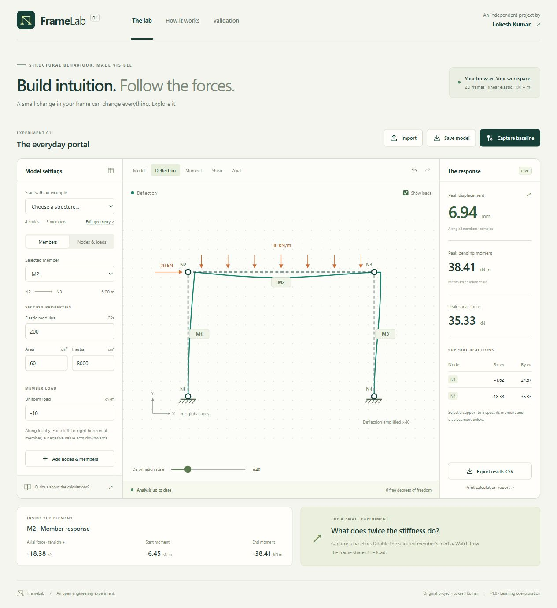

# FrameLab

**Build intuition. Follow the forces.**

An interactive 2D structural behaviour explorer by **Lokesh Kumar**. Edit a frame, apply loads, and see how geometry, supports and stiffness change its response. Everything runs in your browser, with no server, account, API key or commercial engineering software required.



## A one-minute experiment

1. Open the **Portal frame** example.
2. Click **Capture baseline**.
3. Select the horizontal beam **M2**.
4. Change its inertia from **8,000 to 16,000 cm⁴**.
5. Compare the response: peak sampled displacement changes from **6.94 to 5.32 mm**, and peak absolute bending moment changes from **38.41 to 35.65 kN·m**.

Changing one member's stiffness changes load sharing through the whole frame. Try fixing or releasing a ground restraint next.

## What it does

- Editable nodes, member connectivity, cross-section properties and loads.
- Fixed, pinned, vertical-restraint roller, horizontal-restraint roller and free nodes.
- Nodal forces and moments; uniform transverse member loads in local axes.
- Deflected shape, axial, shear and bending-moment diagrams.
- Live reactions, displacement and force summaries; inspect individual nodes and members.
- Baseline comparison and undo/redo.
- Import/export versioned model JSON, export all 101 member stations to CSV, print a calculation report.
- Four original examples: portal, simply supported beam, cantilever and continuous beam.
- A visible calculation method, inspectable global stiffness matrix, and five live analytical benchmarks.
- Responsive interface, keyboard-selectable nodes/members, labelled controls and native dialog focus handling.

## Run locally

Requires **Node.js 24 or newer** and npm.

```sh
npm ci
npm run dev
```

Open `http://127.0.0.1:5173`. The dev server binds to your own device only.

```sh
npm run check    # all tests, strict TypeScript checking, production build
npm run preview  # preview the production build at http://127.0.0.1:4173
```

For a single file that can be opened directly without a server:

```sh
npm run package:offline
```

Open `dist/framelab-offline.html` in a modern browser. JavaScript, styles and the icon are embedded; no installation or network connection is needed to use this generated file.

## Verification

The initial release passes **48 automated tests**:

- Classical beam/bar solutions for deflection, rotation, reactions and bending.
- Fixed-fixed distributed loading with nonzero interior deflection despite zero nodal displacement.
- Linear scaling, load reversal, coordinate rotation/translation and mesh refinement.
- Equilibrium, matrix symmetry, nodal-support behaviour and invalid-model rejection.
- Four independent **PyniteFEA 3.2.0** reference cases, checking every nodal displacement, rotation and reaction.

The independent fixtures were generated by actually running Pynite. They are checked into the repository, so the normal test suite does not need Python. See [validation evidence](docs/VALIDATION.md) and [the calculation method](docs/METHOD.md).

## Engineering scope

This is a **learning and preliminary behaviour exploration tool**. It implements prismatic, linear elastic, small-displacement Euler–Bernoulli members with rigid joints and zero prescribed support movements.

It does not perform capacity, buckling or code-compliance checks. It excludes shear deformation, geometric/material nonlinearity, member-end releases, support settlement, thermal loads and dynamic analysis. A pinned support frees the node's ground rotation; members meeting at that node still share the same rotation.

Maximum absolute moment is evaluated at endpoints and zero-shear positions. Maximum displacement is sampled at **101 positions per member**, not obtained from an exact continuous extremum search. Unstable or numerically ill-conditioned models are rejected. Numerical checks are not a proof of physical adequacy.

| Input                          | Unit          |
| ------------------------------ | ------------- |
| Coordinates                    | m             |
| Nodal force                    | kN            |
| Nodal moment                   | kN·m          |
| Elastic modulus E              | GPa           |
| Area A                         | cm²           |
| Second moment of area I        | cm⁴           |
| Uniform transverse member load | kN/m, local y |
| Displayed displacement         | mm            |

## Architecture

```text
React editor → versioned Model → input validation
                                ↓
                        TypeScript stiffness solver
                                ↓
                        typed Analysis result
                                ↓
                  SVG diagrams · comparison · CSV · print
```

`src/engine` has no React, browser, network or commercial SDK dependency. The numerical implementation is original; Pynite is used only as an independent test reference. The browser-first architecture makes the complete app deployable as static files.

```text
src/engine/           solver, model types, examples, live benchmarks
src/components/       structural SVG renderer
src/App.tsx           editor, comparisons, result and report views
tests/                analytical, invariant, invalid-input and reference tests
tests/fixtures/       independently generated Pynite results
examples/             original portable model JSON files
verification/         scripts for regenerating examples and reference fixtures
docs/                 method, validation evidence and launch material
.github/workflows/    CI and manually triggered GitHub Pages publishing
```

## Publish on GitHub Pages

Push this repository to your personal GitHub account. In **Settings → Pages**, choose **GitHub Actions** as the build source. Then run **Actions → Publish FrameLab → Run workflow** on the desired branch.

The workflow runs all tests and builds before publishing. Deployment is manual; CI runs on pushes and pull requests. Relative asset paths support a repository subpath such as `/framelab/`. The workflow and build setup follow the [Vite deployment documentation](https://vite.dev/guide/static-deploy.html).

See [launch notes](docs/LAUNCH.md) for a LinkedIn draft and demonstration script. Add your actual repository and demo links before posting.

## Independence and data

This is an independent personal project. All examples are synthetic and original. It contains no employer code, models, drawings, templates or internal workflows. The app makes no model-data network requests and uses no analytics or persistent browser storage. Work stays in memory until you explicitly download it; refreshing the page resets the workspace.

## License

MIT © 2026 Lokesh Kumar. See [LICENSE](LICENSE). Third-party packages retain their respective licenses. Pynite is an optional development reference and is not distributed in the browser bundle.
